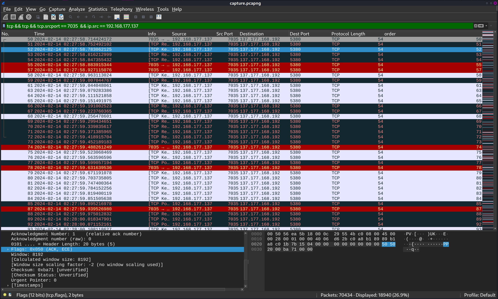

## Exfiltration Pro Max

### Description

As a member of "The Plaid Parliament of Forensics" team, you were assigned an intriguing case involving the CEO of Alpha Inc.'s computer, which has been exhibiting peculiar behavior recently and raises suspicions of compromise. Fortunately, the company's network technician is consistently monitoring and capturing network traffic to ensure the security of the system. We are Afraid of Exfiltarion! Are you able to investigate the incident?

### Solution

- There are many data exfiltrations techniques that can be detected from the network traffic capture, looking for the packets using **Wireshark** I thought at the beginning that the data is being exfiltrated using **icmp ping** packets which is very common, but I didn't get anything useful.

- If you keep looking at the packets you well realize that something weird is with the **tcp packets** between `192.168.177.137:7035`and `137.177.168.192:5380`, the colors are very random which is caused by the randomness of the **tcp flags**, not really random actually.



- If you look at the 3, 4, 5 and 6 tcp packets flags you will find something like this: `50 4b 03 04` which are the magic bytes of a **zip** file, not coincidence for sure.

- A zip file is being exfiltrated here be representing every byte of the file using the tcp flag of each packet. We will extract these bytes using **tshark**. ( You need to specify the source address in the filter as there are some packets in between that are not from this address and they will cause the zip file to be corrupted )

- I used a snipet of code to clean the output a little bit. Then we got a password protected zip file, we can crack it using **John The Ripper**, the password is `california`.

```sh

└─$ tshark -r capture.pcapng -Y 'tcp && tcp.srcport == 7035  && ip.src == 192.168.177.137 && frame.number > 51' -T fields -e "tcp.flags" > to_be_parsed


└─$ python3         
Python 3.11.7 (main, Dec  8 2023, 14:22:46) [GCC 13.2.0] on linux
Type "help", "copyright", "credits" or "license" for more information.
>>> open("extracted.zip", "wb").write(bytes.fromhex(open("to_be_parsed", "r").read().replace("0x00", "").replace("\n", "")))

└─$ zip2john extracted.zip> hash


└─$ john --wordlist=/usr/share/wordlists/rockyou.txt hash


└─$ john --show hash                                     
extracted.zip:california::extracted.zip:flag.txt, flag.png, resume.docx:extracted.zip

```

- Then if we opened the file `resume.docx` and selected the content ( `Ctrl + a` ), we can see some weird blancs, we can decode that in an online decoder from **Whitespace language** and then get the flag.

`nexus{D4TA_Exfl1tr4ti0n_Via_TCP_Flags$$$}`


