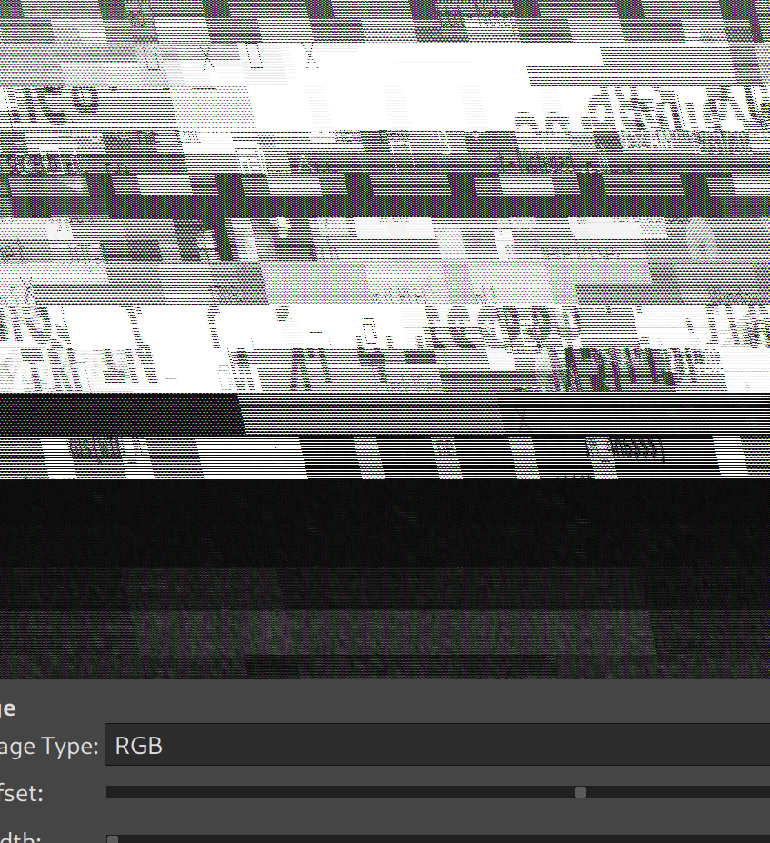

## Perpetrator 

### Description

This elusive perpetrator, known for their craftiness, has managed to infiltrate a secure network, leaving behind a trail of data on their compromised machine.
Your mission is to delve into the memory dump of his machine, analyze artifacts, and extract evidence that could reveal the extent of the criminal's activities.

### Solution

As usual, we have to anaylse the memory dump using volatility ( I used both 3 and 2 )
- Listing the running processes shows that **notepad**, **powershell** and **mstsc.exe** are spawned from the parent process **iexplorer.exe** which is weird for sure.

- After running the **cmdline** plugin, we can see a file named **s3cret.txt.txt** was opened in notepad, I searched for it in the file lising and I dumped it then I found which seems to be the first part of the flag

```sh
└─$ python2 /opt/volatility2/vol.py -f dump.mem --profile=Win7SP1x64 cmdline | grep s3cret
Volatility Foundation Volatility Framework 2.6
Command line : "C:\Windows\system32\NOTEPAD.EXE" C:\Users\perperator\Documents\s3cret.txt.txt


└─$ python3 /opt/volatility/vol.py -f dump.mem windows.filescan | grep s3cret                                                            
0x7cb757d0 100.0\Users\perperator\Documents\s3cret.txt.txt      216


└─$ python3 /opt/volatility/vol.py -f dump.mem windows.dumpfiles --physaddr 0x7cb757d0


└─$ cat file.0x7cb757d0.0xfa8004d96490.DataSectionObject.s3cret.txt.txt.dat
NjggNzQgNzQgNzAgNzMgMjUgMzMgNDEgMjUgMzIgNDYgMjUgMzIgNDYgNzAgNjEgNzMgNzQgNjUgNjIgNjkgNmUgMjUgMzIgNDUgNjMgNmYgNmQgMjUgMzIgNDYgNDQgNDEgNDMgNGEgNDIgNGEgNDQgNjg


#perpetrator

#Th3_4rT_0f_M3m0rY_4n6 

```

But when I searched using the **cmdscan** plugin I realized that this was a fake flag:

```sh
└─$ python2 /opt/volatility2/vol.py -f dump.mem --profile=Win7SP1x64 cmdscan   
Volatility Foundation Volatility Framework 2.6
**************************************************
CommandProcess: conhost.exe Pid: 656
CommandHistory: 0x221e520 Application: powershell.exe Flags: Allocated, Reset
CommandCount: 1 LastAdded: 0 LastDisplayed: 0
FirstCommand: 0 CommandCountMax: 50
ProcessHandle: 0x10
Cmd #0 @ 0x2c7c80: echo "ZmFrZSBmbGFnOiAgIG5leHVze1RoM180clRfMGZfTTNtMHJZXzRuNn0"
Cmd #15 @ 0x280158: ?
Cmd #16 @ 0x221d690:
```

- My doubt led me to search about the other process **mstsc.exe**, I found that it is responsible for creating and launching a Remote Desktop Connection and for producing the **cache** which contains bitmap images for the screen during the session, from the previous challenge `Remote Digital Problems` and some searching I found that this process really contains bitmap images in its **process memory**.

- You can dump the memory of this process and then open it using `gimp`, and by adjusting the **offset** and **width** you will find something like the picture bellow. Keep looking until you find the real flag.

```sh
└─$ python3 /opt/volatility/vol.py -f dump.mem windows.memmap --dump --pid 2304


└─$ gimp mstsc.data 
```




